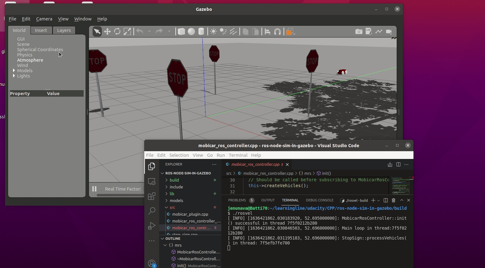

# ROS Node Simulated in Gazebo

This simulation involves a system of two ROS nodes: a ROS-aware plugin to control the model simulation in Gazebo and a main ROS node named `mobicar_ctrl_node` to control vehicles moving and crossing intersections.

The plugin run by Gazebo uses a simple ros-control PID-controller to control the velocity of the vehicles wheel joints. The `mobicar_ctrl_node` uses ros_control to read the state of the vehicles from Gazebo and to dynamically alter the target velocity of the vehicles in simulation. The two nodes use ROS publish/subscribe anonymous message passing for IPC between them.

The simulation environment in Gazebo includes a stop sign. Each mobicar yields the right-of-way to approaching vehicles before proceeding. To achieve this in a thread-safe manner, the `mobicar_ctrl_node` uses concurrent programming techniques, such as mutexes, locks, async, and message queue.

Directory/File Info:
* models/nava_mobicar: an SDF model of a mobile car named “nava_mobicar” for Gazebo
* src/include: source code for a ROS-aware Gazebo plugin to control the model simulation in Gazebo and for the main ROS node named `mobicar_ctrl_node`
* mobicar.world: a custom .world file that attaches the plugin to nava_mobicar model and includes other surrounding elements such as light source, ground plane, stop sign, tree, etc.

## Meeting Rubric Points
* Loops, Functions, I/O  
  line 74 in https://github.com/velvom/ros-node-sim-in-gazebo/blob/main/src/ros_sim_gz/src/stop_sign.cpp => `while` loop  
  line 139 in https://github.com/velvom/ros-node-sim-in-gazebo/blob/main/src/ros_sim_gz/src/mobicar_ros_controller.cpp => `for` loop  
  line 101 in https://github.com/velvom/ros-node-sim-in-gazebo/blob/main/src/ros_sim_gz/src/mobicar_ros_controller.cpp => Use of `function`  
  line 117 in https://github.com/velvom/ros-node-sim-in-gazebo/blob/main/src/ros_sim_gz/src/mobicar_plugin.cpp => Use of `function`  
  line 59 in https://github.com/velvom/ros-node-sim-in-gazebo/blob/main/src/ros_sim_gz/src/mobicar_plugin.cpp => I/O, reading the model elements from model.sdf   
  https://github.com/velvom/ros-node-sim-in-gazebo/blob/main/src/ros_sim_gz/models/nava_mobicar/model.sdf => I/O, Gazebo model file
* Object Oriented Programming  
  line 27 in https://github.com/velvom/ros-node-sim-in-gazebo/blob/main/src/ros_sim_gz/include/mobicar_plugin.h => Inherit MobicarPlugin from ModelPlugin  
  line 64, 70 in https://github.com/velvom/ros-node-sim-in-gazebo/blob/main/src/ros_sim_gz/include/vehicle.h => Data encapsulation with access specifier  
  line 98, 111 in https://github.com/velvom/ros-node-sim-in-gazebo/blob/main/src/ros_sim_gz/src/vehicle.cpp => Classes encapsulate behavior  
  line 7 in https://github.com/velvom/ros-node-sim-in-gazebo/blob/main/src/ros_sim_gz/src/vehicle.cpp => Use of list initialization in constructor  
  line 17 in https://github.com/velvom/ros-node-sim-in-gazebo/blob/main/src/ros_sim_gz/include/mobicar_ros_controller.h => Inherit from std::enable_shared_from_this  
  line 43 in https://github.com/velvom/ros-node-sim-in-gazebo/blob/main/src/ros_sim_gz/include/mobicar_ros_controller.h => Composite object of ros::NodeHandle  
  line 17 in https://github.com/velvom/ros-node-sim-in-gazebo/blob/main/src/ros_sim_gz/include/stop_sign.h => Templated MessageQueue implementation
* Memory Management  
  line 13, 114 in https://github.com/velvom/ros-node-sim-in-gazebo/blob/main/src/ros_sim_gz/src/mobicar_ros_controller.cpp => Use of `pass by reference`  
  line 84 in https://github.com/velvom/ros-node-sim-in-gazebo/blob/main/src/ros_sim_gz/src/mobicar_plugin.cpp => Use of `unique_ptr`  
  line 17, 18 in https://github.com/velvom/ros-node-sim-in-gazebo/blob/main/src/ros_sim_gz/src/mobicar_ros_controller.cpp => Use of `shared_ptr`  
  line 33 in https://github.com/velvom/ros-node-sim-in-gazebo/blob/main/src/ros_sim_gz/src/stop_sign.cpp => Use of `move` semantics  
  line 40 in https://github.com/velvom/ros-node-sim-in-gazebo/blob/main/src/ros_sim_gz/src/stop_sign.cpp => Use of `shared_ptr`  
  line 12 in https://github.com/velvom/ros-node-sim-in-gazebo/blob/main/src/ros_sim_gz/src/mobicar_ros_controller_main.cpp => Use of `RAII`
* Concurrency  
  line 16, 17 in https://github.com/velvom/ros-node-sim-in-gazebo/blob/main/src/ros_sim_gz/src/stop_sign.cpp => Use of `mutex`, `condvar`  
  line 57, 63 in https://github.com/velvom/ros-node-sim-in-gazebo/blob/main/src/ros_sim_gz/src/stop_sign.cpp => Use of `lock_guard`  
  line 85 in https://github.com/velvom/ros-node-sim-in-gazebo/blob/main/src/ros_sim_gz/src/stop_sign.cpp => Use of `future`/`async`  
  line 69 in https://github.com/velvom/ros-node-sim-in-gazebo/blob/main/src/ros_sim_gz/src/stop_sign.cpp => Running processVehicles() in a separate thread, multithreading  
  line 16 in https://github.com/velvom/ros-node-sim-in-gazebo/blob/main/src/ros_sim_gz/src/mobicar_ros_controller_main.cpp => Use of multithreading  
  line 162 in https://github.com/velvom/ros-node-sim-in-gazebo/blob/main/src/ros_sim_gz/src/mobicar_ros_controller.cpp => Use of message queue to schedule vehicles thru intersection

## Dependencies for Building/Running Locally
* cmake >= 2.8
  * Linux OS: [click here for installation instructions](https://cmake.org/install/)
* make >= 4.1 (Linux)
  * Linux: make is installed by default on most Linux distros
* gcc/g++ >= 5.4
  * Linux: gcc / g++ is installed by default on most Linux distros
* Install GAZEBO, includiing headers needed for plugin development:
  * Linux OS: [click here for installation instructions](http://gazebosim.org/tutorials?tut=install_ubuntu&cat=install)
* Install ROS: [click here for installation instructions](http://wiki.ros.org/ROS/Installation)
  * For instance, for Ubuntu 20.04 LTS, install ROS Noetic Ninjemys distribution.
* Install ros_control: [click here for installation instructions](http://wiki.ros.org/ros_control)
  * For Notetic distribution: sudo apt-get install ros-noetic-ros-control ros-noetic-ros-controllers
* Install colcon: [click here for installation instructions](https://colcon.readthedocs.io/en/released/user/installation.html)

## Build/Run Instructions
### Option I: Native Linux Host (eg. Ubuntu 20.04)
#### Build
1. Clone this repo.  
2. `cd` \<top-level directory\>  
3. Source ROS: `source /opt/ros/noetic/setup.bash`  
4. Compile: `colcon build`

#### Run

1. From a termial, source ROS and start roscore as follows.  
   $ `source /opt/ros/noetic/setup.bash`  
   $ `roscore`

2. Open another terminal and execute the following from the top-level directory to launch Gazebo world with mobicar model.  
   $ `source /usr/share/gazebo-11/setup.sh`  
   $ `export GAZEBO_MODEL_PATH=<top-level directory>/src/ros_sim_gz/models:${GAZEBO_MODEL_PATH}`  
   $ `source install/setup.bash`  
   $ `rosrun gazebo_ros gazebo --verbose src/ros_sim_gz/mobicar.world`

3. Now, from the terminal you compiled the code, execute the main ros node to start the simulation.  
   $ `cd` \<top-level directory\>  
   $ `source install/setup.bash`  
   $ `rosrun ros_sim_gz rosvel`
   
 
### Option II: Containerization 
#### Build/Run
1. Clone this repo.  
2. `cd` \<top-level directory\>  
3. Build a docker image from Dockerfile having ros:melodic as base image: `./ build_docker_image.bash`   
4. Start the image: `./start_docker_image.bash`  
5. From a separate terminal, download the `VNC Viewer` application from RealVNC Web site and install it.  
6. Open `VNC Viewer` and enter the `VNC server` address (eg. localhost:5900) to view the Gazebo simulation and other GUI windows.  
**Note**: Refer to the `./start_docker_image.bash` script to find out port exposed to the host from container.
